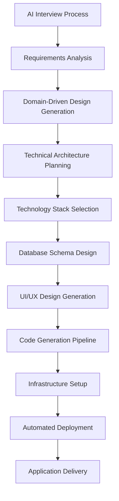

# AI-Powered End-to-End Application Development Platform

## 🎯 Project Vision

An intelligent platform that transforms business requirements into fully functional, deployed applications through automated AI-driven development processes. The platform bridges the gap between business needs and technical implementation by providing two distinct user experiences: a **Black Box Solution** for non-technical users and a **Developer Kit** for technical teams.

## 🚀 Core Concept

**Input**: Natural language business requirements  
**Output**: Complete, deployed application with source code

The platform conducts AI-driven interviews to understand business needs, generates technical architectures using Domain-Driven Design principles, creates UI/UX designs, generates production-ready code, and automatically deploys applications to cloud infrastructure.

## 🎪 Target Audiences

### Primary Markets
- **College Students**: Quick project development for academic requirements
- **Small Business Owners**: Custom business applications without technical expertise
- **Startups**: Rapid MVP development and prototyping
- **Developers**: Accelerated development with automated boilerplate generation

### User Personas
- **Non-Technical Users**: Complete black-box experience with ready-to-use applications
- **Technical Users**: Access to source code, repositories, and customizable infrastructure

## 🏗️ System Architecture

### High-Level Workflow



## 🔧 Detailed Implementation Pipeline

### Phase 1: Requirements Gathering & Analysis
**AI Business Interviewer**
- Conducts structured interviews using natural language processing
- Asks contextual follow-up questions based on business domain
- Validates and clarifies requirements through interactive sessions
- Generates comprehensive requirement specifications

**Output**: Structured business requirements document with user stories and acceptance criteria

### Phase 2: Domain-Driven Design (DDD) Generation
**Strategic DDD Modeling**
- Identifies bounded contexts and domain boundaries
- Maps business processes to technical domains
- Defines entities, value objects, and aggregates
- Creates domain event flows and command structures

**Tactical DDD Implementation**
- Generates repository patterns and domain services
- Defines API contracts and data models
- Creates integration points between bounded contexts

**Output**: Complete domain model with architectural boundaries

### Phase 3: Technical Architecture & Technology Selection

#### Black Box Mode
- AI automatically selects optimal technology stack
- Considers scalability, performance, and business requirements
- Pre-configured best practices and architectural patterns

#### Developer Kit Mode
- Presents technology recommendations with rationale
- Allows developer input and customization
- Provides architectural alternatives and trade-offs

**Output**: Technical architecture diagram with technology specifications

### Phase 4: Database & API Design
**Database Schema Generation**
- Automatic table structure creation from domain models
- Relationship mapping and constraint definition
- Migration script generation for different database systems

**API Specification Creation**
- RESTful API endpoint generation
- OpenAPI/Swagger documentation
- Authentication and authorization patterns

**Output**: Database schema, API documentation, and integration specifications

### Phase 5: UI/UX Design Generation
**Design System Creation**
- Generate design tokens and component libraries
- Create responsive layout templates
- Establish visual hierarchy and user flow patterns

**Prototype Development**
- Interactive wireframes and mockups
- User journey mapping
- Accessibility compliance considerations

**Output**: Design system documentation and interactive prototypes

### Phase 6: Code Generation Pipeline
**Backend Development**
- API endpoint implementation
- Business logic and domain services
- Database integration and ORM setup
- Authentication and security implementation

**Frontend Development**
- Component-based UI implementation
- State management setup
- API integration and data flow
- Responsive design implementation

**Quality Assurance**
- Automated test generation
- Code quality analysis
- Security vulnerability scanning

**Output**: Complete, tested application codebase

### Phase 7: Infrastructure & Deployment
**Infrastructure as Code (IaC)**
- Cloud resource provisioning (AWS/Azure/GCP)
- Container orchestration setup
- Load balancing and scaling configuration
- Monitoring and logging implementation

**CI/CD Pipeline Setup**
- Automated build and deployment processes
- Environment management (dev/staging/production)
- Rollback and versioning strategies

**Output**: Deployed application with complete infrastructure

## 🛠️ Technology Stack

### AI & Machine Learning
- **Language Models**: GPT-4, Claude, or custom-trained models
- **Specialized AI**: Domain-specific models for code generation
- **Template Engines**: Intelligent template selection and customization

### Backend Infrastructure
- **Platform Core**: Node.js/Python microservices architecture
- **Code Generation**: Template-based generation with AI customization
- **Infrastructure**: Docker containers, Kubernetes orchestration
- **Deployment**: Terraform, Ansible, cloud-native services

### Generated Application Stack
- **Frontend**: React/Vue.js/Angular with responsive design
- **Backend**: Node.js/Python/Java with RESTful APIs
- **Database**: PostgreSQL/MongoDB/MySQL with optimized schemas
- **Cloud**: AWS/Azure/GCP with auto-scaling capabilities

### Development Tools
- **Version Control**: Automated Git repository creation
- **CI/CD**: GitHub Actions, GitLab CI, or Jenkins pipelines
- **Monitoring**: Application performance and health monitoring
- **Documentation**: Automated technical and user documentation

## 🎨 Key Features

### For Non-Technical Users (Black Box)
- **Conversational Requirements Gathering**: Natural language input processing
- **One-Click Deployment**: Fully automated application delivery
- **Custom Domain Setup**: Professional application hosting
- **User Management**: Built-in authentication and user roles
- **Data Management**: Intuitive admin interfaces
- **Mobile Responsiveness**: Cross-device compatibility

### For Developers (Developer Kit)
- **Source Code Access**: Complete repository with clean, documented code
- **Customizable Architecture**: Modular design for easy modifications
- **Database Integration**: Ready-to-connect database configurations
- **API Documentation**: Comprehensive endpoint documentation
- **Development Environment**: Local setup with development tools
- **Deployment Flexibility**: Multiple hosting and deployment options

## 🔄 Dual Service Models

### Black Box Experience
```
User Input → AI Processing → Deployed Application
```
- No technical knowledge required
- Immediate application delivery
- Hosted solution with maintenance included
- Limited customization options

### Developer Kit Experience
```
User Input → AI Processing → Source Code + Infrastructure → Developer Customization
```
- Full source code access
- Complete development environment
- Unlimited customization potential
- Self-hosted or cloud deployment options

## 🎯 Implementation Phases

### Phase 1: MVP Development (6-8 months)
- Basic AI interviewer for simple business applications
- Template-based code generation for CRUD applications
- Single cloud provider deployment (AWS)
- Limited application types (inventory, CRM, basic e-commerce)

### Phase 2: Enhanced Capabilities (4-6 months)
- Advanced DDD implementation
- Multi-cloud deployment options
- Expanded application templates
- Developer kit with source code access

### Phase 3: Advanced Features (6-9 months)
- Custom UI/UX generation
- Complex business logic handling
- Integration with third-party services
- Advanced deployment and scaling options

### Phase 4: Enterprise Scale (6-12 months)
- Multi-tenant architecture
- Enterprise security and compliance
- Advanced analytics and monitoring
- Custom domain and white-label solutions

## ⚡ Competitive Advantages

### Technical Innovation
- **End-to-End Automation**: Complete development lifecycle coverage
- **DDD-Based Architecture**: Structured, maintainable application design
- **Dual-Market Approach**: Serves both technical and non-technical users
- **Quality Assurance**: Built-in testing and validation at every stage

### Business Benefits
- **Speed to Market**: Applications ready in hours instead of months
- **Cost Efficiency**: Dramatic reduction in development costs
- **Consistency**: Standardized best practices and patterns
- **Scalability**: Cloud-native architecture with auto-scaling

## 🚧 Technical Challenges & Solutions

### Challenge: AI Code Quality
**Solution**: Multi-layer validation with human oversight checkpoints and extensive testing

### Challenge: Complex Business Logic
**Solution**: Start with well-defined patterns and gradually expand capabilities

### Challenge: UI/UX Generation Limitations
**Solution**: Use template-based designs with AI customization rather than full generation

### Challenge: Integration Complexity
**Solution**: Focus on common integration patterns and provide extension points

### Challenge: Performance and Scalability
**Solution**: Cloud-native architecture with proven scaling patterns

## 🔍 Success Metrics

### Technical KPIs
- Application generation time (target: <2 hours)
- Code quality scores (target: >85% automated test coverage)
- Deployment success rate (target: >95%)
- Performance benchmarks (target: <3 second load times)

### Business KPIs
- User satisfaction scores
- Application uptime and reliability
- Time-to-value for customers
- Platform adoption and retention rates

## 🚀 Getting Started

### For Team Development
1. **Requirements Analysis**: Define specific application types and business domains
2. **Technical Proof of Concept**: Build MVP for one application type
3. **AI Model Training**: Develop domain-specific conversation and generation models
4. **Infrastructure Setup**: Create cloud deployment pipelines
5. **User Testing**: Validate concept with target user groups

### Next Steps
1. Market validation with potential customers
2. Technical feasibility testing for core components
3. Team assembly and role definition
4. Development roadmap and milestone planning
5. Prototype development and user feedback collection

---

**This platform represents the future of application development - where business ideas become reality through intelligent automation, making software development accessible to everyone while maintaining professional quality and technical excellence.**