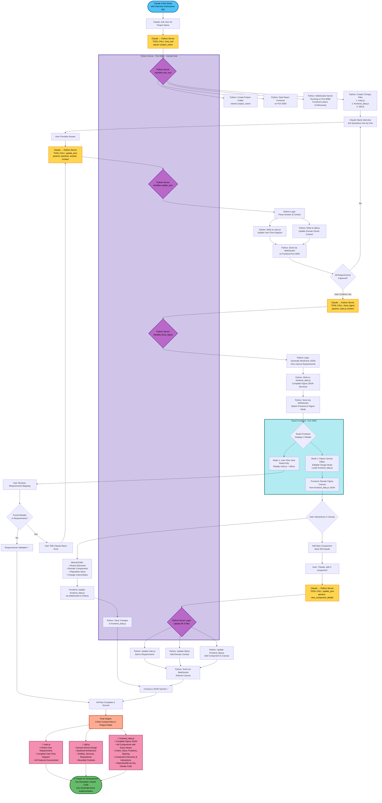

```mermaid
graph TB
    Start([Claude Code Starts<br/>with Interview Instructions MD]) --> AskProject[Claude: Ask User for Project Name]
    
    AskProject --> HostToolCall[Claude → Python Server<br/>TOOL CALL: host_tool<br/>param: project_name]
    
    HostToolCall --> PythonHost{Python Server<br/>Handles host_tool}
    
    PythonHost --> CreateFolder[Python: Create Project Folder<br/>named 'project_name']
    PythonHost --> CreateFiles[Python: Create 3 Empty Files<br/>1. main.js<br/>2. frontend_data.js<br/>3. ddd.js]
    PythonHost --> StartFrontend[Python: Start React Frontend<br/>on Port 3000]
    PythonHost --> WSConnect[Python: WebSocket Server<br/>Running on Port 8080<br/>Frontend Listens Continuously]
    
    CreateFiles --> Interview[Claude Starts Interview<br/>Ask Questions One by One]
    
    Interview --> UserAnswer[User Provides Answer]
    
    UserAnswer --> UpdateToolCall[Claude → Python Server<br/>TOOL CALL: update_json<br/>params: question, answer, context]
    
    UpdateToolCall --> PythonUpdate{Python Server<br/>Handles update_json}
    
    PythonUpdate --> UpdateLogic[Python Logic:<br/>Parse Answer & Context]
    UpdateLogic --> WriteMain[Python: Write to main.js<br/>Update User Flow Diagram]
    UpdateLogic --> WriteDDD[Python: Write to ddd.js<br/>Update Domain Driven Context]
    
    WriteMain --> NotifyFrontend1[Python: Send via WebSocket<br/>to Frontend Port 3000]
    WriteDDD --> NotifyFrontend1
    
    NotifyFrontend1 --> CheckComplete{All Requirements<br/>Captured?}
    
    CheckComplete -->|No| Interview
    CheckComplete -->|User Confirms Yes| FigmaToolCall[Claude → Python Server<br/>TOOL CALL: show_figma<br/>params: main.js content]
    
    FigmaToolCall --> PythonFigma{Python Server<br/>Handles show_figma}
    
    PythonFigma --> GenerateJSON[Python Logic:<br/>Generate Wireframe JSON<br/>from main.js Requirements]
    
    GenerateJSON --> WriteFrontendData[Python: Write to frontend_data.js<br/>Complete Figma JSON Structure]
    
    WriteFrontendData --> NotifyFrontend2[Python: Send via WebSocket<br/>Switch Frontend to Figma Mode]
    
    NotifyFrontend2 --> FrontendModes{React Frontend<br/>Displays 2 Modes}
    
    FrontendModes --> Mode1[Mode 1: User Flow View<br/>Read-Only<br/>Display main.js + ddd.js]
    FrontendModes --> Mode2[Mode 2: Figma Canvas Editor<br/>Editable Design Mode<br/>Loads frontend_data.js]
    
    Mode1 --> ViewMapping[User Reviews Requirements Mapping]
    ViewMapping --> ErrorCheck1{Found Mistake<br/>in Requirements?}
    ErrorCheck1 -->|Yes| TellClaude1[User Tells Claude About Error]
    TellClaude1 --> UpdateToolCall
    ErrorCheck1 -->|No| Validated[Requirements Validated ✓]
    
    Mode2 --> RenderCanvas[Frontend: Render Figma Canvas<br/>from frontend_data.js JSON]
    
    RenderCanvas --> UserInteract{User Interactions in Canvas}
    
    UserInteract --> ManualEdit[Manual Edits:<br/>• Resize Elements<br/>• Reorder Components<br/>• Reposition Items<br/>• Change Colors/Styles]
    UserInteract --> AddNewElement[Add New Component:<br/>Must Tell Claude]
    
    ManualEdit --> FrontendUpdate[Frontend: Update frontend_data.js<br/>via WebSocket to Python]
    FrontendUpdate --> PythonSave[Python: Save Changes<br/>to frontend_data.js]
    PythonSave --> CanvasSynced[Canvas & JSON Synced ✓]
    
    AddNewElement --> TellClaude2[User: 'Claude, add X component']
    TellClaude2 --> UpdateToolCall2[Claude → Python Server<br/>TOOL CALL: update_json<br/>params: new_component_details]
    
    UpdateToolCall2 --> PythonUpdateAll{Python Server Logic:<br/>Update All 3 Files}
    
    PythonUpdateAll --> UpdateMain2[Python: Update main.js<br/>Add to Requirements]
    PythonUpdateAll --> UpdateDDD2[Python: Update ddd.js<br/>Add Domain Context]
    PythonUpdateAll --> UpdateFrontend2[Python: Update frontend_data.js<br/>Add Component to Canvas]
    
    UpdateMain2 --> NotifyFrontend3[Python: Send via WebSocket<br/>Refresh Canvas]
    UpdateDDD2 --> NotifyFrontend3
    UpdateFrontend2 --> NotifyFrontend3
    
    NotifyFrontend3 --> CanvasSynced
    
    Validated --> ReadyOutput
    CanvasSynced --> ReadyOutput
    
    ReadyOutput[All Files Complete & Synced]
    
    ReadyOutput --> FinalOutput[Final Output:<br/>3 Rich Context Files in Project Folder]
    
    FinalOutput --> Output1[📄 main.js<br/>• Perfect User Requirements<br/>• Complete User Flow Diagram<br/>• All Features Documented]
    
    FinalOutput --> Output2[📄 ddd.js<br/>• Domain Driven Design<br/>• Backend Architecture<br/>• Entities, Services, Repositories<br/>• Bounded Contexts]
    
    FinalOutput --> Output3[📄 frontend_data.js<br/>• Complete Figma JSON<br/>• All Components with Exact Values<br/>• Colors, Sizes, Positions, Spacing<br/>• Component Hierarchy & Interactions<br/>• Reproducible by Any Claude Code]
    
    Output1 --> End([✅ Ready for Development<br/>Any Developer Claude Code<br/>Can Generate Exact Implementation])
    Output2 --> End
    Output3 --> End
    
    subgraph PythonServerCore[" Python Server - Port 8080 - Central Hub "]
        PythonHost
        PythonUpdate
        PythonFigma
        PythonUpdateAll
        PythonSave
    end
    
    subgraph ReactFrontendApp[" React Frontend - Port 3000 "]
        FrontendModes
        Mode1
        Mode2
        RenderCanvas
    end
    
    style Start fill:#4fc3f7,stroke:#01579b,stroke-width:3px,color:#000
    style End fill:#66bb6a,stroke:#1b5e20,stroke-width:3px,color:#000
    style HostToolCall fill:#ffd54f,stroke:#f57f17,stroke-width:2px,color:#000
    style UpdateToolCall fill:#ffd54f,stroke:#f57f17,stroke-width:2px,color:#000
    style FigmaToolCall fill:#ffd54f,stroke:#f57f17,stroke-width:2px,color:#000
    style UpdateToolCall2 fill:#ffd54f,stroke:#f57f17,stroke-width:2px,color:#000
    style PythonServerCore fill:#d1c4e9,stroke:#4527a0,stroke-width:3px
    style ReactFrontendApp fill:#b2ebf2,stroke:#006064,stroke-width:3px
    style FinalOutput fill:#ffab91,stroke:#bf360c,stroke-width:3px,color:#000
    style Output1 fill:#f48fb1,stroke:#880e4f,stroke-width:2px,color:#000
    style Output2 fill:#f48fb1,stroke:#880e4f,stroke-width:2px,color:#000
    style Output3 fill:#f48fb1,stroke:#880e4f,stroke-width:2px,color:#000
    style PythonHost fill:#ba68c8,stroke:#4a148c,stroke-width:2px,color:#000
    style PythonUpdate fill:#ba68c8,stroke:#4a148c,stroke-width:2px,color:#000
    style PythonFigma fill:#ba68c8,stroke:#4a148c,stroke-width:2px,color:#000
    style PythonUpdateAll fill:#ba68c8,stroke:#4a148c,stroke-width:2px,color:#000
```