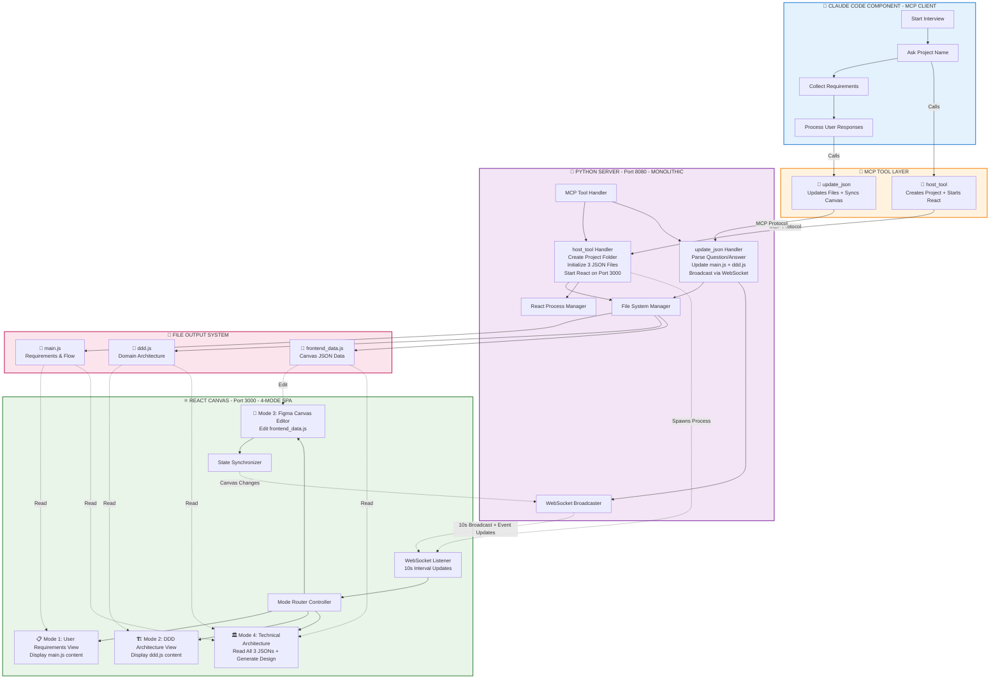

```mermaid
graph TB
    subgraph CC["🤖 CLAUDE CODE COMPONENT - MCP CLIENT"]
        CC1[Start Interview]
        CC2[Ask Project Name]
        CC3[Collect Requirements]
        CC4[Process User Responses]
        CC1 --> CC2 --> CC3 --> CC4
    end
    
    subgraph MCP["📡 MCP TOOL LAYER"]
        MCP1[🔧 host_tool<br/>Creates Project + Starts React]
        MCP2[🔧 update_json<br/>Updates Files + Syncs Canvas]
    end
    
    subgraph PS["🐍 PYTHON SERVER - Port 8080 - MONOLITHIC"]
        PS1[MCP Tool Handler]
        PS2[File System Manager]
        PS3[WebSocket Broadcaster]
        PS4[React Process Manager]
        
        PST1[host_tool Handler<br/>Create Project Folder<br/>Initialize 3 JSON Files<br/>Start React on Port 3000]
        PST2[update_json Handler<br/>Parse Question/Answer<br/>Update main.js + ddd.js<br/>Broadcast via WebSocket]
        
        PS1 --> PST1
        PS1 --> PST2
        PST1 --> PS2
        PST1 --> PS4
        PST2 --> PS2
        PST2 --> PS3
    end
    
    subgraph RC["⚛️ REACT CANVAS - Port 3000 - 4-MODE SPA"]
        RC1[WebSocket Listener<br/>10s Interval Updates]
        RC2[Mode Router Controller]
        RC3[📋 Mode 1: User Requirements View<br/>Display main.js content]
        RC4[🏗️ Mode 2: DDD Architecture View<br/>Display ddd.js content]
        RC5[🎨 Mode 3: Figma Canvas Editor<br/>Edit frontend_data.js]
        RC6[🏛️ Mode 4: Technical Architecture<br/>Read All 3 JSONs + Generate Design]
        RC7[State Synchronizer]
        
        RC1 --> RC2
        RC2 --> RC3
        RC2 --> RC4
        RC2 --> RC5
        RC2 --> RC6
        RC5 --> RC7
    end
    
    subgraph FS["📁 FILE OUTPUT SYSTEM"]
        FS1[📄 main.js<br/>Requirements & Flow]
        FS2[📄 ddd.js<br/>Domain Architecture] 
        FS3[📄 frontend_data.js<br/>Canvas JSON Data]
    end
    
    %% MCP Tool Flow
    CC2 -->|Calls| MCP1
    CC4 -->|Calls| MCP2
    
    MCP1 -->|MCP Protocol| PST1
    MCP2 -->|MCP Protocol| PST2
    
    %% File Operations
    PS2 --> FS1
    PS2 --> FS2
    PS2 --> FS3
    
    %% WebSocket Broadcasting
    PS3 -.->|10s Broadcast + Event Updates| RC1
    RC7 -.->|Canvas Changes| PS3
    
    %% React Launch
    PST1 -.->|Spawns Process| RC1
    
    %% File Reading for React Modes
    FS1 -.->|Read| RC3
    FS2 -.->|Read| RC4
    FS3 -.->|Edit| RC5
    FS1 -.->|Read| RC6
    FS2 -.->|Read| RC6
    FS3 -.->|Read| RC6
    
    %% Styling
    style CC fill:#e3f2fd,stroke:#1976d2,stroke-width:2px
    style MCP fill:#fff3e0,stroke:#f57c00,stroke-width:2px
    style PS fill:#f3e5f5,stroke:#7b1fa2,stroke-width:2px
    style RC fill:#e8f5e8,stroke:#2e7d32,stroke-width:2px
    style FS fill:#fce4ec,stroke:#c2185b,stroke-width:2px
```