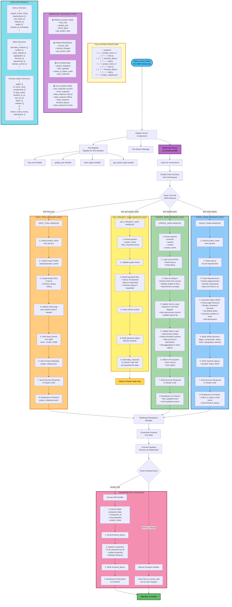

```mermaid
graph TB
    Start([Python Server Starts<br/>Port 8080 WebSocket]) --> Init[Initialize Server Components]
    
    Init --> WSServer[WebSocket Server<br/>ws://localhost:8080]
    Init --> FileSystem[File System Manager]
    Init --> ToolRegistry[Tool Registry<br/>Register All Tool Handlers]
    
    ToolRegistry --> Tool1[host_tool Handler]
    ToolRegistry --> Tool2[update_json Handler]
    ToolRegistry --> Tool3[show_figma Handler]
    ToolRegistry --> Tool4[get_project_data Handler]
    
    WSServer --> Listen[Listen for Connections]
    Listen --> ClaudeConnect[Claude Code Connects<br/>Tool Call Request]
    
    ClaudeConnect --> ParseRequest{Parse Tool Call<br/>JSON Request}
    
    ParseRequest -->|tool: host_tool| HostHandler[HOST_TOOL HANDLER]
    ParseRequest -->|tool: update_json| UpdateHandler[UPDATE_JSON HANDLER]
    ParseRequest -->|tool: show_figma| FigmaHandler[SHOW_FIGMA HANDLER]
    ParseRequest -->|tool: get_project_data| GetDataHandler[GET_PROJECT_DATA HANDLER]
    
    subgraph HostToolLogic[" HOST_TOOL HANDLER LOGIC "]
        HostHandler --> H1[1. Extract project_name<br/>from params]
        H1 --> H2[2. Create Project Folder<br/>./projects/project_name/]
        H2 --> H3[3. Create Empty Files:<br/>• main.js<br/>• frontend_data.js<br/>• ddd.js]
        H3 --> H4[4. Initialize React App<br/>npm install & build if needed]
        H4 --> H5[5. Start React Server<br/>Port 3000<br/>serve -s build -l 3000]
        H5 --> H6[6. Store Project Metadata<br/>project_registry.json]
        H6 --> H7[7. Send Success Response<br/>to Claude Code]
        H7 --> H8[8. Broadcast to Frontend<br/>project_initialized event]
    end
    
    subgraph UpdateJsonLogic[" UPDATE_JSON HANDLER LOGIC "]
        UpdateHandler --> U1[1. Extract params:<br/>• question<br/>• answer<br/>• context<br/>• project_name]
        U1 --> U2[2. Load Current Files:<br/>• Read main.js<br/>• Read ddd.js]
        U2 --> U3[3. Parse & Analyze:<br/>• Extract intent from answer<br/>• Identify entities & flows<br/>• Map domain concepts]
        U3 --> U4[4. Update main.js Logic:<br/>• Append to user flow diagram<br/>• Add requirements section<br/>• Update feature list]
        U4 --> U5[5. Update ddd.js Logic:<br/>• Add domain entities<br/>• Define bounded contexts<br/>• Map services & repositories<br/>• Add aggregates & value objects]
        U5 --> U6[6. Write to File System:<br/>• Save main.js<br/>• Save ddd.js]
        U6 --> U7[7. Send Success Response<br/>to Claude Code]
        U7 --> U8[8. Broadcast to Frontend:<br/>• files_updated event<br/>• Send updated content]
    end
    
    subgraph FigmaToolLogic[" SHOW_FIGMA HANDLER LOGIC "]
        FigmaHandler --> F1[1. Extract project_name<br/>from params]
        F1 --> F2[2. Read main.js<br/>Get all requirements]
        F2 --> F3[3. Parse Requirements:<br/>• Extract pages/screens<br/>• Identify components<br/>• Map user flows to UI]
        F3 --> F4[4. Generate Figma JSON:<br/>• Create page hierarchy<br/>• Design component structure<br/>• Set default styles<br/>• Calculate positions & sizes<br/>• Add interactions]
        F4 --> F5[5. Build JSON Structure:<br/>pages, components, styles,<br/>colors, typography, spacing]
        F5 --> F6[6. Write frontend_data.js:<br/>Complete Figma JSON]
        F6 --> F7[7. Send Success Response<br/>to Claude Code]
        F7 --> F8[8. Broadcast to Frontend:<br/>• switch_to_figma_mode event<br/>• Send frontend_data.js]
    end
    
    subgraph GetDataLogic[" GET_PROJECT_DATA HANDLER LOGIC "]
        GetDataHandler --> G1[1. Extract params:<br/>• project_name<br/>• files_requested array]
        G1 --> G2[2. Validate project exists]
        G2 --> G3[3. Read requested files:<br/>• main.js if requested<br/>• ddd.js if requested<br/>• frontend_data.js if requested]
        G3 --> G4[4. Parse JSON content]
        G4 --> G5[5. Build response object<br/>with file contents]
        G5 --> G6[6. Send data_response<br/>to Claude Code with<br/>all requested file data]
    end
    
    H8 --> WSBroadcast[WebSocket Broadcast Manager]
    U8 --> WSBroadcast
    F8 --> WSBroadcast
    G6 --> ClaudeResponse[Send to Claude Code Only]
    
    WSBroadcast --> FrontendConn[Connected Frontend<br/>Port 3000]
    
    FrontendConn --> FrontendUpdate[Frontend Updates<br/>Receive via WebSocket]
    
    FrontendUpdate --> ParseFrontend{Parse Frontend Event}
    
    ParseFrontend -->|canvas_edit| CanvasEdit[Canvas Edit Handler]
    ParseFrontend -->|manual_changes| ManualEdit[Manual Changes Handler]
    
    subgraph FrontendEditLogic[" FRONTEND EDIT HANDLERS "]
        CanvasEdit --> E1[1. Extract edited component data:<br/>• component_id<br/>• new properties<br/>• project_name]
        E1 --> E2[2. Read frontend_data.js]
        E2 --> E3[3. Update Component:<br/>• Find component by ID<br/>• Update properties<br/>• Maintain hierarchy]
        E3 --> E4[4. Write frontend_data.js]
        E4 --> E5[5. Broadcast Confirmation<br/>to Frontend]
        
        ManualEdit --> M1[Same flow as canvas_edit<br/>but for bulk changes]
    end
    
    E5 --> Complete[Operation Complete]
    M1 --> Complete
    
    subgraph FileStructure[" FILE SYSTEM STRUCTURE "]
        FS1[📁 projects/<br/>├── 📁 project_name_1/<br/>│   ├── 📄 main.js<br/>│   ├── 📄 frontend_data.js<br/>│   └── 📄 ddd.js<br/>├── 📁 project_name_2/<br/>│   ├── 📄 main.js<br/>│   ├── 📄 frontend_data.js<br/>│   └── 📄 ddd.js<br/>└── 📄 project_registry.json]
    end
    
    subgraph APIEndpoints[" WEBSOCKET MESSAGE TYPES "]
        API1[📥 FROM CLAUDE CODE:<br/>• host_tool<br/>• update_json<br/>• show_figma<br/>• get_project_data]
        API2[📥 FROM FRONTEND:<br/>• canvas_edit<br/>• manual_changes<br/>• get_project_data]
        API3[📤 TO FRONTEND:<br/>• project_initialized<br/>• files_updated<br/>• switch_to_figma_mode<br/>• edit_confirmed]
        API4[📤 TO CLAUDE CODE:<br/>• tool_response success<br/>• error_response<br/>• data_response main.js<br/>• data_response ddd.js<br/>• data_response frontend_data.js<br/>• data_response all_files]
    end
    
    subgraph DataModels[" JSON DATA MODELS "]
        DM1["main.js Structure:<br/>{<br/>  project_name: string,<br/>  requirements: [],<br/>  user_flows: [],<br/>  features: [],<br/>  pages: [],<br/>  created_at: timestamp<br/>}"]
        DM2["ddd.js Structure:<br/>{<br/>  bounded_contexts: [],<br/>  entities: [],<br/>  value_objects: [],<br/>  aggregates: [],<br/>  services: [],<br/>  repositories: [],<br/>  domain_events: []<br/>}"]
        DM3["frontend_data.js Structure:<br/>{<br/>  pages: [{<br/>    id, name, route,<br/>    components: [{<br/>      id, type, props,<br/>      position: {x, y},<br/>      size: {w, h},<br/>      styles: {},<br/>      children: []<br/>    }]<br/>  }],<br/>  theme: {colors, fonts},<br/>  interactions: []<br/>}"]
    end
    
    style Start fill:#4fc3f7,stroke:#01579b,stroke-width:3px,color:#000
    style WSServer fill:#ba68c8,stroke:#4a148c,stroke-width:3px,color:#000
    style HostToolLogic fill:#ffcc80,stroke:#e65100,stroke-width:3px
    style UpdateJsonLogic fill:#a5d6a7,stroke:#1b5e20,stroke-width:3px
    style FigmaToolLogic fill:#90caf9,stroke:#0d47a1,stroke-width:3px
    style GetDataLogic fill:#fff176,stroke:#f57f17,stroke-width:3px
    style FrontendEditLogic fill:#f48fb1,stroke:#880e4f,stroke-width:3px
    style FileStructure fill:#fff9c4,stroke:#f57f17,stroke-width:3px
    style APIEndpoints fill:#ce93d8,stroke:#4a148c,stroke-width:3px
    style DataModels fill:#80deea,stroke:#006064,stroke-width:3px
    style Complete fill:#66bb6a,stroke:#1b5e20,stroke-width:3px,color:#000
    style ClaudeResponse fill:#ffd54f,stroke:#f57f17,stroke-width:2px,color:#000
```