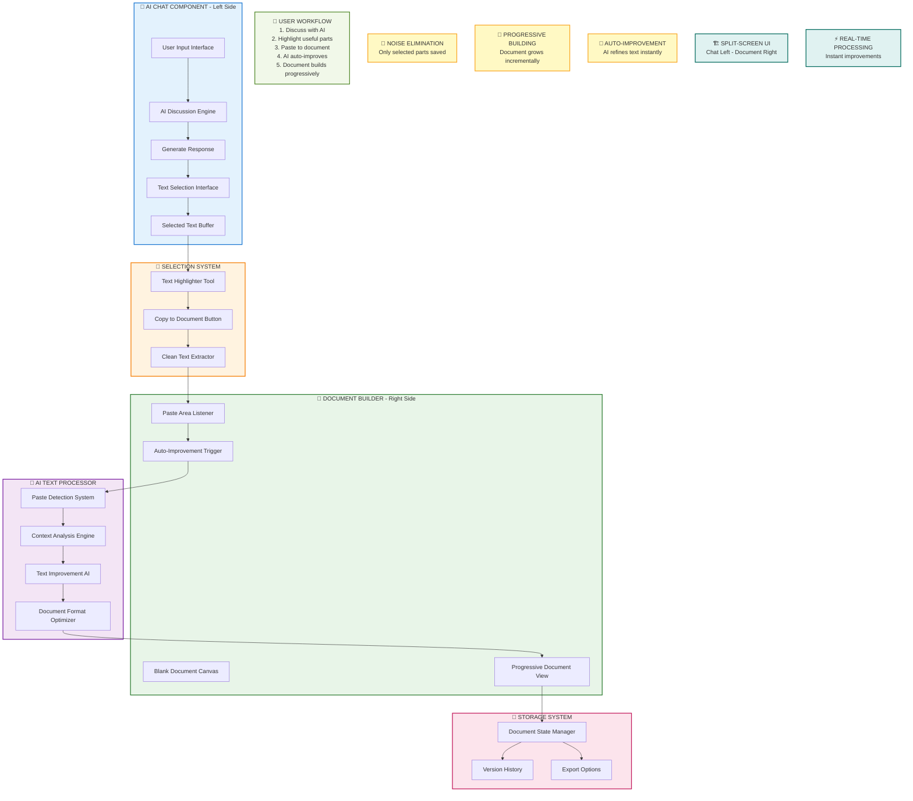

Discuss freely with AI and get lots of ideas
Select specific parts from AI responses (not the whole noisy response)
Paste selected parts to a blank document area on the right
AI automatically refines and improves the pasted text into proper documentation
Build a clean document progressively without creating full projects